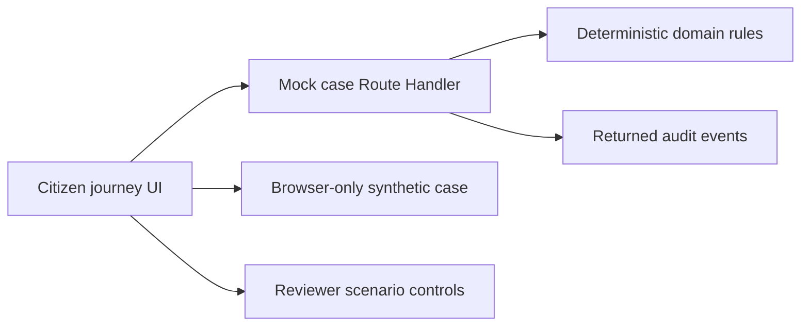

# LicencePath - Sarathi Portal prototype

LicencePath is a citizen-first, mobile-friendly prototype focused on one problem: helping a first-time Learner's Licence holder determine when an LL-to-DL request is eligible, what evidence is needed, and what happens after an uncertain payment.

[Open the live portal](https://licencepath-sarathi.vercel.app) | [Read the product overview](docs/PORTAL.md) | [Review the submission kit](SUBMISSION.md)

> [!IMPORTANT]
> This is an independent, unofficial prototype. It is not affiliated with or endorsed by MoRTH, NIC, Sarathi, mParivahan, any State Transport Department, any RTO or the Government of India. Use synthetic demo data only.

## Why this portal exists

Product hypothesis: first-time applicants may discover eligibility or evidence requirements too late, or mistake a timed-out payment for a failed payment. LicencePath tests whether one guided case can reduce that avoidable rework by explaining:

- what the citizen needs to do next;
- who owns the next action;
- what has already been saved or acknowledged;
- how to recover safely when a step fails.

## Working prototype

| Capability | What the demo shows |
| --- | --- |
| Focused scope | LL-to-DL is the only interactive service; four adjacent services are honestly marked as not included. |
| Exception scenarios | Reviewer controls load early, expired, invalid, mismatch, unreadable-document, no-slot, failed-test, correction and dispatch-failure paths. |
| Evidence boundary | The About page reports that no applicant interviews, production-flow audit or failure statistics have yet been completed. |
| Eligibility before effort | A deterministic Delhi pilot rule checks the Learner's Licence date before documents or payment. |
| Synthetic record retrieval | A reviewer-controlled test credential retrieves a fictional citizen record after explicit consent. |
| Evidence guidance | The portal generates safe fixture documents and reports validation feedback. |
| Payment recovery | A timed-out mock payment is reconciled without creating a duplicate charge. |
| Idempotent submission | A visible interrupted-connection retry uses the same key and returns one mock application reference. |
| End-to-end status | The final stage exposes clearly labelled synthetic timeline controls, while the citizen view keeps owner, next action and recovery explicit. |
| Inclusive access | English, Hindi, Tamil, Marathi, Telugu, Kannada and Bengali entry-point translations, reduced-motion support, visible keyboard focus and consented assisted mode are included. English and Hindi continue across the full reviewer journey. |
| Recovery and grievance | Explicit continue/new/reset choices, a bookmarkable same-browser case URL, and categorized synthetic grievance status are included. |
| Mock service layer | Payment and submission mutations go through `/api/demo/cases/[caseId]` and return audit events. |

## Routes

| Route | Purpose |
| --- | --- |
| `/` | Interactive citizen journey and all mock workflow states |
| `/about` | English portal purpose, scope, safety boundary and production direction |
| `/about/hi` | Hindi version of the About page |
| `/case/[caseId]` | Bookmarkable same-browser synthetic case recovery route |
| `/api/demo/cases/[caseId]` | Mock case contract plus payment/submission operations and audit results |
| `/licencepath-demo-payment-receipt.txt` | Synthetic English payment receipt fixture |
| `/licencepath-demo-payment-receipt-hi.txt` | Synthetic Hindi payment receipt fixture |

## Demo path

1. Confirm synthetic-data use and start the LL-to-DL check; the eligible fixture is prefilled.
2. Review the synthetic LL number and date, then continue to identity.
3. Give consent and choose **Use demo credential**.
4. Enter the supplied synthetic address and attach each generated evidence fixture.
5. Start one payment. After the timeout, reconcile that same reference instead of paying again.
6. Submit through the mock API, simulate a connection retry and observe the same application reference.
7. Choose an appointment, then use **Play remaining demo updates** to reach the explicit completion state.

Open **Reviewer demo controls** at the end of any stage only when you want to test an exception path.

Use the scenario selector to demonstrate eligibility waiting, expiry, invalid records, identity mismatch, unreadable evidence, unavailable appointments, failed tests, corrections and dispatch recovery.

### Synthetic demo identifiers

- Citizen: `Asha Verma`
- Mobile: `+91 90000 00000`
- Learner's Licence: `LL-DL99-2026-000123`
- Test OTP: `482916`
- Case: `LP-DEMO-20260827-0001`

These values are fictional and cannot be used for any real service.

## Technology

- Next.js App Router with React and TypeScript
- Native responsive CSS with light, dark and high-contrast modes
- Phosphor icons
- Deterministic TypeScript domain functions
- Browser local storage for synthetic demo state plus explicit resume/reset controls
- Next.js Route Handler mock service for payment, submission and audit results
- Vitest for domain tests
- Vercel for the public deployment

## Current architecture



The current build is intentionally self-contained. The API route is real application code but not durable infrastructure: case detail still lives only in this browser, while the server returns deterministic mock mutations and audit events. No government, identity, payment, appointment, dispatch or notification system is contacted.

For production, the same citizen journey should use an API or BFF, a durable case and workflow service, PostgreSQL, protected object storage and a durable queue. Every external dependency should sit behind a versioned provider adapter. Payment and submission should remain separate, idempotent state machines with reconciliation and an append-only event trail.

## Repository structure

```text
app/                         Next.js routes, metadata and global styles
components/                  Citizen journey, multilingual entry copy and bilingual About content
lib/                         Deterministic Sarathi domain functions
public/                      Synthetic downloadable receipt fixtures
tests/                       Domain tests
docs/PORTAL.md               Product, journey and production overview
README.md                    Setup and repository handoff
SUBMISSION.md                Hackathon summary and video plan
```

## Run locally

Requirements: Node.js 20 or newer and pnpm.

```powershell
pnpm install
pnpm dev
```

Open `http://localhost:3000`.

## Verify changes

```powershell
pnpm test
pnpm build
```

Both commands should pass before pushing. Vercel automatically builds the linked GitHub repository after a push.

## Accessibility

- Semantic headings, landmarks and labels support assistive technology.
- Keyboard focus remains visible and the main content has a skip link.
- Body text, controls and focus states meet a readable baseline without adding persistent display toggles to the portal header.
- Motion respects the user's reduced-motion preference.
- English and Hindi About routes have descriptive page titles for route announcements.

## Data and safety boundaries

- Never enter real Aadhaar, PAN, licence, OTP, payment or address information.
- All identifiers, fees, records, slots and status events are synthetic fixtures.
- The browser stores demo progress locally so it can be resumed; reset the demo to clear that state.
- No real payment is initiated and no government application is submitted.
- Production use requires authorised integrations, state policy validation, threat modelling, privacy and legal review, accessibility testing and department-owned operations.

## Documentation

- [Portal overview](docs/PORTAL.md)
- [Codebase design and module map](docs/CODEBASE.md)
- [Submission kit](SUBMISSION.md)
- [Live About page](https://licencepath-sarathi.vercel.app/about)
- [Hindi About page](https://licencepath-sarathi.vercel.app/about/hi)

## Project status

This repository is a working hackathon prototype, not a production government service. Its core problem and before/after comparison remain hypotheses until real applicant research and an observed current-flow audit are completed.
