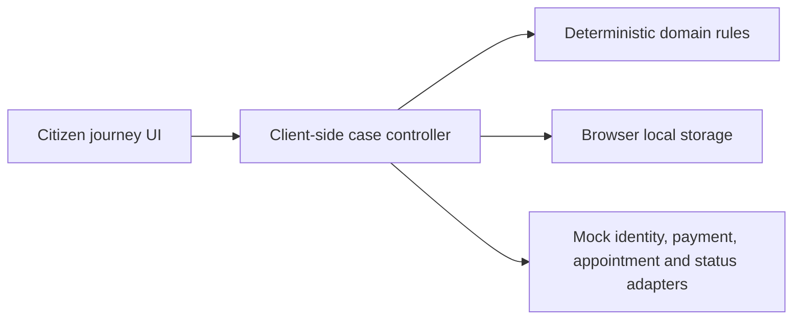

# LicencePath - Sarathi Portal prototype

LicencePath is a citizen-first, mobile-friendly prototype that demonstrates a clearer journey from a Learner's Licence to a permanent Driving Licence. The GitHub repository is named `Sarathi-Portal`; the public prototype uses the distinct LicencePath name to make its independent status clear.

[Open the live portal](https://licencepath-sarathi.vercel.app) | [Read the product overview](docs/PORTAL.md) | [Review the submission kit](SUBMISSION.md)

> [!IMPORTANT]
> This is an independent, unofficial prototype. It is not affiliated with or endorsed by MoRTH, NIC, Sarathi, mParivahan, any State Transport Department, any RTO or the Government of India. Use synthetic demo data only.

## Why this portal exists

A first-time or low-tech citizen can struggle to understand eligibility, evidence, payment, appointment and status across separate menus and handoffs. LicencePath replaces that fragmented experience with one guided case that always explains:

- what the citizen needs to do next;
- who owns the next action;
- what has already been saved or acknowledged;
- how to recover safely when a step fails.

## Working prototype

| Capability | What the demo shows |
| --- | --- |
| Eligibility before effort | A deterministic Delhi pilot rule checks the Learner's Licence date before documents or payment. |
| Synthetic record retrieval | A displayed test OTP retrieves a fictional citizen record after explicit consent. |
| Evidence guidance | The portal generates safe fixture documents and reports validation feedback. |
| Payment recovery | A timed-out mock payment is reconciled without creating a duplicate charge. |
| Idempotent submission | Repeated submission uses one mock application reference. |
| End-to-end status | Simulated appointment, test, approval, dispatch and delivery events appear in one timeline. |
| Inclusive access | English, Hindi, larger text, high contrast, reduced-motion support and consented assisted mode are included. |
| Recovery and grievance | Autosave, resume and a synthetic grievance path are available from every stage. |

## Routes

| Route | Purpose |
| --- | --- |
| `/` | Interactive citizen journey and all mock workflow states |
| `/about` | English portal purpose, scope, safety boundary and production direction |
| `/about/hi` | Hindi version of the About page |
| `/licencepath-demo-payment-receipt.txt` | Synthetic English payment receipt fixture |
| `/licencepath-demo-payment-receipt-hi.txt` | Synthetic Hindi payment receipt fixture |

## Demo path

1. Confirm that you will use synthetic data and continue with the prefilled eligible date.
2. Consent to retrieve Asha Verma's fictional record.
3. Enter the displayed test OTP: `482916`.
4. Confirm the record and attach all three generated evidence fixtures.
5. Simulate payment. When it becomes Pending, reconcile it instead of paying again.
6. Submit once, choose a simulated test slot and advance mock events to delivery.

To demonstrate eligibility recovery, change the LL issue date to `2026-07-30`. The portal blocks payment on day 29 and explains the earliest valid date.

### Synthetic demo identifiers

- Citizen: `Asha Verma`
- Mobile: `+91 90000 00000`
- Learner's Licence: `LL-DL99-2026-000123`
- Test OTP: `482916`
- Case: `LP-DEMO-20260827-0001`

These values are fictional and cannot be used for any real service.

## Technology

- Next.js App Router with React and TypeScript
- Native responsive CSS with light, dark and high-contrast modes
- Phosphor icons
- Deterministic TypeScript domain functions
- Browser local storage for synthetic demo state
- Vitest for domain tests
- Vercel for the public deployment

## Current architecture



The current build is intentionally self-contained. It does not contact government, identity, payment, appointment, dispatch or notification systems.

For production, the same citizen journey should use an API or BFF, a durable case and workflow service, PostgreSQL, protected object storage and a durable queue. Every external dependency should sit behind a versioned provider adapter. Payment and submission should remain separate, idempotent state machines with reconciliation and an append-only event trail.

## Repository structure

```text
app/                         Next.js routes, metadata and global styles
components/                  Citizen journey and bilingual About content
lib/                         Deterministic Sarathi domain functions
public/                      Synthetic downloadable receipt fixtures
tests/                       Domain tests
docs/PORTAL.md               Product, journey and production overview
README.md                    Setup and repository handoff
SUBMISSION.md                Hackathon summary and video plan
```

## Run locally

Requirements: Node.js 20 or newer and pnpm.

```powershell
pnpm install
pnpm dev
```

Open `http://localhost:3000`.

## Verify changes

```powershell
pnpm test
pnpm build
```

Both commands should pass before pushing. Vercel automatically builds the linked GitHub repository after a push.

## Accessibility

- Semantic headings, landmarks and labels support assistive technology.
- Keyboard focus remains visible and the main content has a skip link.
- Larger text and high-contrast controls are available in the portal header.
- Motion respects the user's reduced-motion preference.
- English and Hindi About routes have descriptive page titles for route announcements.

## Data and safety boundaries

- Never enter real Aadhaar, PAN, licence, OTP, payment or address information.
- All identifiers, fees, records, slots and status events are synthetic fixtures.
- The browser stores demo progress locally so it can be resumed; reset the demo to clear that state.
- No real payment is initiated and no government application is submitted.
- Production use requires authorised integrations, state policy validation, threat modelling, privacy and legal review, accessibility testing and department-owned operations.

## Documentation

- [Portal overview](docs/PORTAL.md)
- [Submission kit](SUBMISSION.md)
- [Live About page](https://licencepath-sarathi.vercel.app/about)
- [Hindi About page](https://licencepath-sarathi.vercel.app/about/hi)

## Project status

This repository is a working hackathon prototype, not a production government service. Its purpose is to demonstrate a safer information flow, explicit recovery patterns and a provider-neutral production direction using only synthetic data.
