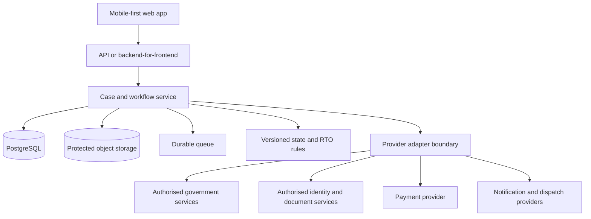

# LicencePath portal overview

## Product intent

LicencePath tests one focused proposition: a first-time applicant should be able to determine LL-to-DL eligibility and evidence needs before payment, then recover safely when payment, submission, appointment or downstream status is uncertain.

LL-to-DL is the only interactive service. Replacement, name, address and mobile changes are displayed as not included in this prototype.

## Evidence status

The problem is a product hypothesis. This project has not completed applicant interviews, an observed production Sarathi journey, or a quantitative failure analysis, and it makes no claim about failure rates. The recommended next step is 5–8 observed sessions with first-time Delhi applicants on the current flow, followed by a comparative usability test of LicencePath.

## Citizen journey

### Start one focused journey

The citizen begins an LL-to-DL request. Adjacent services are disabled and labelled as future research. The before/after table is explicitly a hypothesis to validate, not an audited description of every State portal.

### Check eligibility

A deterministic, versioned Delhi demo rule pack evaluates each selected branch before the citizen uploads evidence or reaches payment. The LL-to-DL branch checks the issue date; other branches show their configured demo availability. An ineligible fixture explains the earliest valid date rather than returning a generic error.

### Explore exceptions deliberately

A separate Reviewer controls panel loads ten deterministic scenarios. These include an early or expired LL, invalid record, identity mismatch, unreadable evidence, no appointment slots, failed test, correction request and dispatch failure. Reviewer event controls never appear as the citizen's next action.

### Retrieve a synthetic record

The citizen provides consent and uses a visibly labelled test credential in the identity step. No real identity provider, DigiLocker account or Sarathi record is contacted.

### Prepare and review evidence

The prototype derives service-specific fields, deduplicates shared evidence into one combined checklist, attaches safe fixtures, validates them and presents a review step before any irreversible action.

### Reconcile payment

The simulated gateway can return an ambiguous Pending state. The citizen is guided to reconcile the existing attempt instead of paying again. Payment and application submission remain separate states.

### Submit once

Submission uses a visible idempotency key and returns one mock application reference. The reviewer can simulate an interrupted connection and retry; the mock API returns the same reference and records `retry_returned_existing_application`.

### Book and track

The citizen chooses a simulated test appointment or sees a no-slot recovery path that preserves the submitted application. The final stage can play the remaining synthetic provider updates and reach an explicit completion state without hiding the fact that citizens would never approve their own outcomes in production. Reviewer controls remain available for failed-test, correction and dispatch-recovery scenarios.

### Recover or raise a grievance

Progress is autosaved in browser storage. The start screen requires an explicit choice to continue the saved demo or clear it. A bookmarkable `/case/[caseId]` URL recovers only in the same browser; this limitation is stated. The grievance path captures category, generated evidence, reference, owner and status without inventing a response-time commitment.

## Experience principles

1. Check eligibility before collecting effort, evidence or payment.
2. Keep one case and one timeline across all service handoffs.
3. Preserve acknowledged work when a downstream dependency fails.
4. Reconcile ambiguous payment and submission outcomes before retrying.
5. Explain the next action, owner and expected recovery route in plain language.
6. Support Hindi, assistive technology, slow networks and consented assistance.
7. Collect only the data needed for the selected service.

## What is implemented

- Responsive Next.js citizen journey
- One focused LL-to-DL journey with adjacent services honestly out of scope
- Ten deterministic success and exception scenarios
- Combined, deduplicated evidence and fee review
- English and Hindi interface content
- Eligibility and application state domain functions
- Synthetic identity, evidence, payment, appointment and status fixtures
- Explicit continue/new/reset controls and a same-browser case deep link
- Mock case API with payment, submission and audit operations
- Accessibility controls and keyboard-friendly interaction
- Payment receipt fixtures
- Automated domain tests
- Public Vercel deployment

## What is simulated

- Identity verification and OTP delivery
- Sarathi record reads and application writes
- DigiLocker and document-provider access
- Payment gateway calls and reconciliation
- Appointment availability and booking
- Driving test, approval, printing, dispatch and delivery events
- Notification delivery and departmental grievance updates

## Production direction

The production domain should keep eligibility, evidence, payment, submission, appointment, test, approval and dispatch as distinct states. Transitions should be database-side, versioned and auditable. Background work should be durable, queued and idempotent.

## Production prerequisites

- Formal ownership by the relevant government departments
- Authorised API access and provider agreements
- State and RTO rule validation with effective dates
- Verified fee schedules and operating procedures
- Threat modelling, privacy impact assessment and legal review
- Encryption, secrets management, audit logs and retention controls
- Independent accessibility testing with disabled users
- Department-owned support, incident response and grievance operations
- Observability, service-level objectives and disaster recovery

## Safety statement

LicencePath is an independent prototype for demonstration and evaluation. It must never accept real identity, licence, payment or government application data in its current form. All names, identifiers, fees, records, appointments and status events are synthetic.
