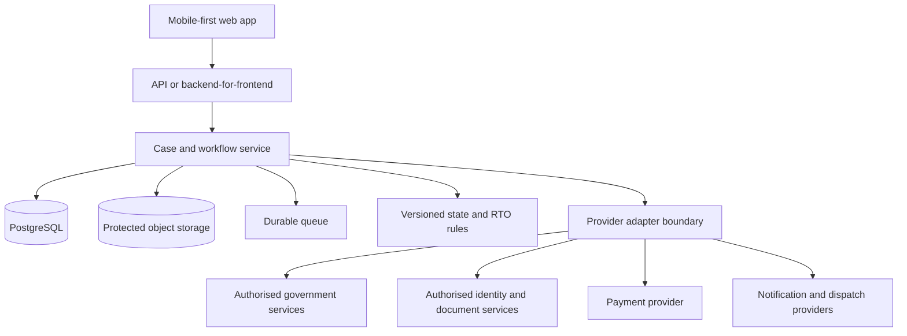

# LicencePath portal overview

## Product intent

LicencePath demonstrates how a driving licence service can start with a citizen's goal instead of a department menu. The prototype focuses on one guided case from Learner's Licence eligibility to simulated delivery of a permanent Driving Licence.

The experience is designed for first-time applicants, citizens with limited digital confidence and helpers acting with explicit consent. It keeps the next action, responsible party and recovery route visible throughout the journey.

## Citizen journey

### Choose the service

The citizen starts from intent. The current fixture covers a Learner's Licence to permanent Driving Licence journey and keeps the model open to future service types.

### Check eligibility

A deterministic Delhi pilot rule checks the issue date before the citizen uploads evidence or reaches payment. An ineligible fixture explains the earliest valid date rather than returning a generic error.

### Retrieve a synthetic record

The citizen provides consent, uses the displayed test OTP and retrieves a fictional record. No real identity provider, DigiLocker account or Sarathi record is contacted.

### Prepare and review evidence

The prototype creates safe evidence fixtures, validates them and presents a review step before any irreversible action.

### Reconcile payment

The simulated gateway can return an ambiguous Pending state. The citizen is guided to reconcile the existing attempt instead of paying again. Payment and application submission remain separate states.

### Submit once

Submission uses an idempotency key and returns one mock application reference. Repeated interaction cannot create a second application in the demo.

### Book and track

The citizen chooses a simulated test appointment and advances synthetic events through test, approval, dispatch and delivery. The case timeline shows whether the citizen, department or delivery provider owns the next action.

### Recover or raise a grievance

Progress is autosaved in browser storage. A citizen can resume the demo or open a synthetic grievance path from any stage without losing acknowledged work.

## Experience principles

1. Check eligibility before collecting effort, evidence or payment.
2. Keep one case and one timeline across all service handoffs.
3. Preserve acknowledged work when a downstream dependency fails.
4. Reconcile ambiguous payment and submission outcomes before retrying.
5. Explain the next action, owner and expected recovery route in plain language.
6. Support Hindi, assistive technology, slow networks and consented assistance.
7. Collect only the data needed for the selected service.

## What is implemented

- Responsive Next.js citizen journey
- English and Hindi interface content
- Eligibility and application state domain functions
- Synthetic identity, evidence, payment, appointment and status fixtures
- Local autosave and reset
- Accessibility controls and keyboard-friendly interaction
- Payment receipt fixtures
- Automated domain tests
- Public Vercel deployment

## What is simulated

- Identity verification and OTP delivery
- Sarathi record reads and application writes
- DigiLocker and document-provider access
- Payment gateway calls and reconciliation
- Appointment availability and booking
- Driving test, approval, printing, dispatch and delivery events
- Notification delivery and departmental grievance updates

## Production direction

The production domain should keep eligibility, evidence, payment, submission, appointment, test, approval and dispatch as distinct states. Transitions should be database-side, versioned and auditable. Background work should be durable, queued and idempotent.

## Production prerequisites

- Formal ownership by the relevant government departments
- Authorised API access and provider agreements
- State and RTO rule validation with effective dates
- Verified fee schedules and operating procedures
- Threat modelling, privacy impact assessment and legal review
- Encryption, secrets management, audit logs and retention controls
- Independent accessibility testing with disabled users
- Department-owned support, incident response and grievance operations
- Observability, service-level objectives and disaster recovery

## Safety statement

LicencePath is an independent prototype for demonstration and evaluation. It must never accept real identity, licence, payment or government application data in its current form. All names, identifiers, fees, records, appointments and status events are synthetic.
